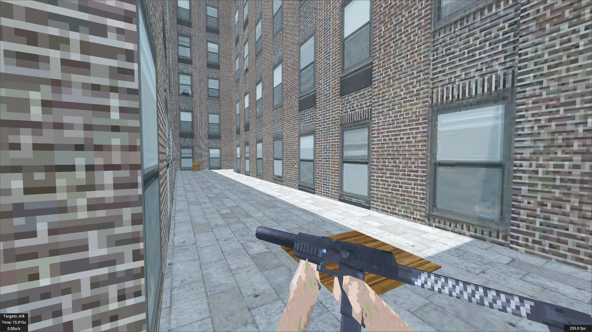
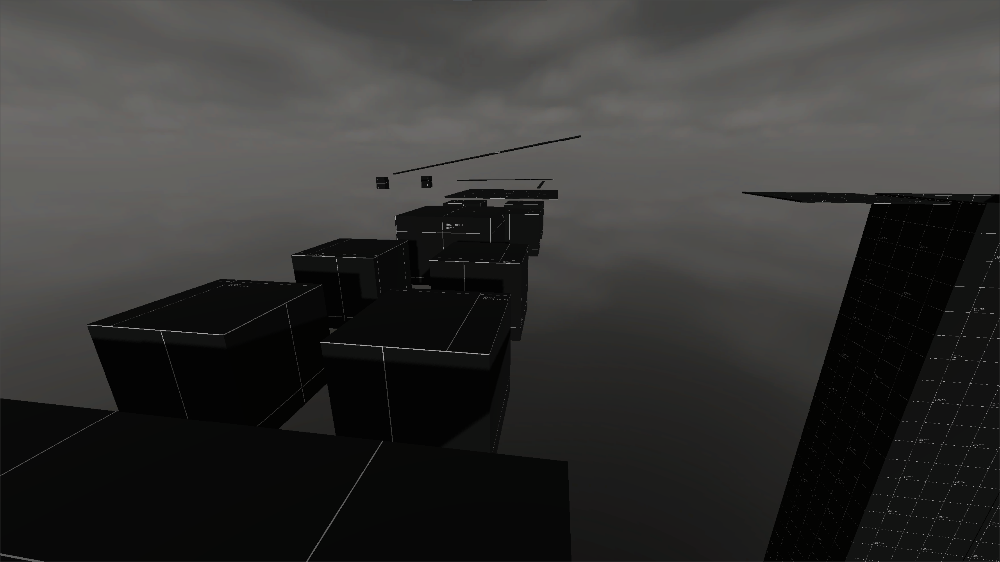

# Straif

Straif is a fast-paced 3D platforming shooter where you race through a variety of hand crafted maps to achieve the fastest time on the global leaderboard.

It is heavily inspired by source engine games such as Counter Strike: Source, leaving a high skill ceiling for players to compete.

## Quick Links
- [Website](#Website)
- [Web Api](#Web-Api)
- [Screenshots](#Screenshots)
- [Local Setup](#Local-Setup)

## Website
There is an online leaderboard hosted on [straif.pumped.software](https://straif.pumped.software/).

## Web Api
The straif [web api](https://straifapi.pumped.software) is public and [documentation](https://straifapi.pumped.software) can be viewed as well.

## Screenshots



## Local Setup

### Game Client
```bash
git clone https://github.com/vasiltop/straif
cd straif
cp settings.json.example settings.json
godot -e
```

### Hosting a game server

The game executable can be ran as a game server as well by providing the following arguments.

```bash
./straif server <name> <port> <max_players> <mode: "deathmatch"> --headless
```

This will continously ping the server browser to let other players know your server is online.

### Server
```bash
cd server
cp .env.example .env
docker compose up -d
npm install
npx drizzle-kit push
npm run dev
```
