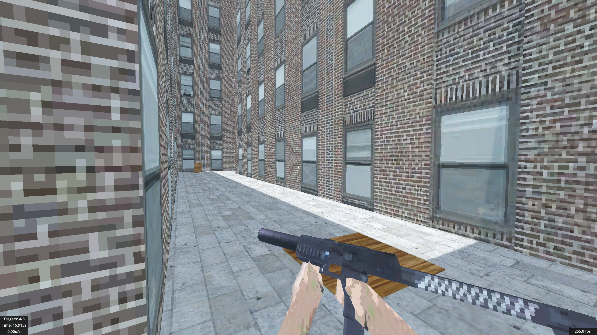
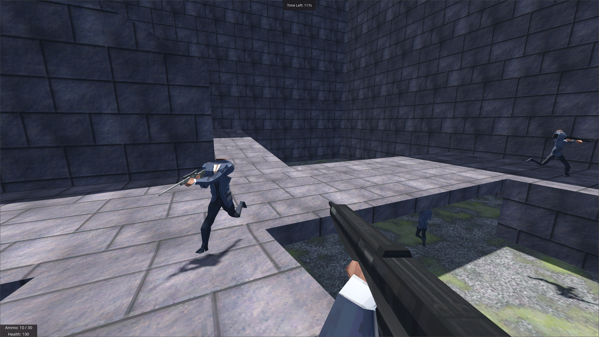
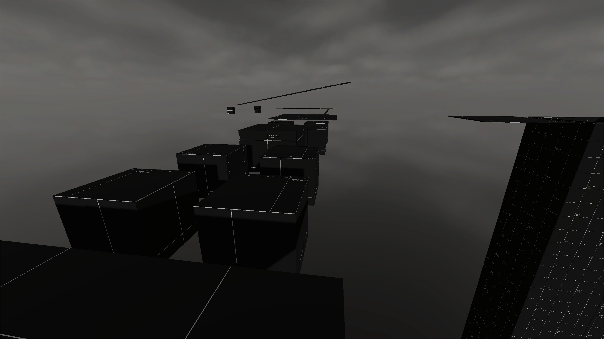

# Straif

Straif is a fast-paced 3D platforming shooter where you race through a variety of hand crafted maps to achieve the fastest time on the global leaderboard.

It is heavily inspired by source engine games such as Counter Strike: Source, leaving a high skill ceiling for players to compete.

## Quick Links
- [Website](#Website)
- [Web Api](#Web-Api)
- [Screenshots](#Screenshots)
- [Local Setup](#Local-Setup)
- [Steam Deployment](#Steam-Deployment)

## Website
The straif leaderboard can be viewed at [straif.pumped.software](https://straif.pumped.software/).

## Web Api
The straif [web api](https://straifapi.pumped.software) is public and [documentation](https://straifapi.pumped.software/docs) can be viewed as well.

## Screenshots




## Local Setup

### Game Client
```bash
git clone https://github.com/vasiltop/straif
cd straif
godot -e
```

### Hosting a game server

The game executable can be ran as a game server as well by providing the following arguments.

```bash
./straif server <name> <port> <max_players> <mode> --headless

# for example
./straif server DM-1 3005 5 deathmatch --headless
```

This will continously ping the server browser to let other players know your server is online.

### Server
```bash
cd server
cp .env.example .env
docker compose up -d
npm install
npx drizzle-kit push
npm run dev
```

## Steam Deployment

### One-time setup

Install SteamCMD:

```bash
mkdir -p ~/.local/steamcmd
curl -sqL "https://steamcdn-a.akamaihd.net/client/installer/steamcmd_linux.tar.gz" \
  | tar -xzf - -C ~/.local/steamcmd
```

```bash
~/.local/steamcmd/steamcmd.sh +login YOUR_STEAM_USERNAME
```

Copy the env file and fill in your depot IDs from the [Steamworks depots page](https://partner.steamgames.com/apps/depots/3850480):

```bash
cp steam/steam.env.example steam/steam.env
```

### Upload a build

```bash
./scripts/export-all.sh                  # or ./scripts/upload-steam.sh --build
./scripts/upload-steam.sh
```
