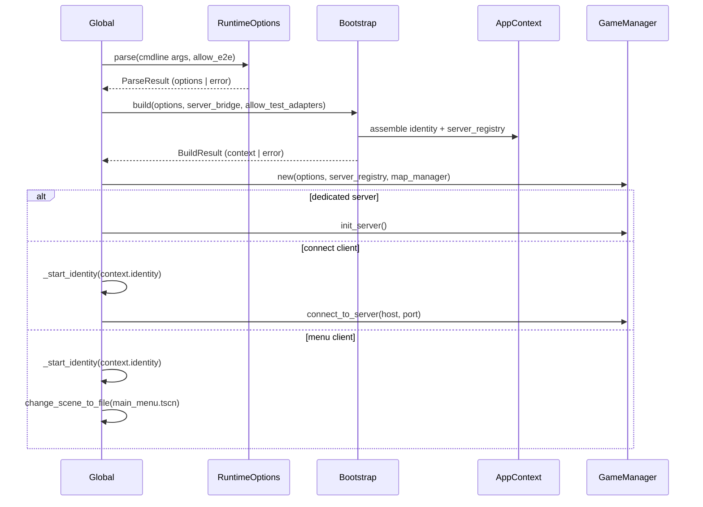
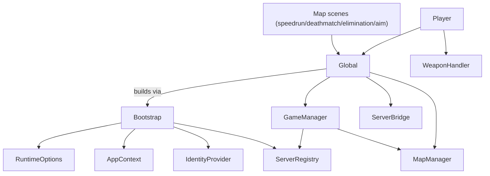

# Architecture

Overview of the Godot client/dedicated-server binary's runtime composition. For
gameplay-mode behavior see [gameplay.md](./gameplay.md); for dedicated-server
operations see [game-server.md](./game-server.md).

## Repository layout (Godot project)

| Path | Contents |
| --- | --- |
| `src/app/` | Composition root: `RuntimeOptions`, `AppContext`, `Bootstrap`. |
| `src/platform/identity/` | `IdentityProvider` boundary + `SteamIdentityProvider` / `FakeIdentityProvider` adapters. |
| `src/platform/server_registry/` | `ServerRegistry` boundary + `HttpServerRegistry` / `RecordingServerRegistry` adapters. |
| `src/global.gd` | Autoload compatibility facade (see below). |
| `src/game_manager.gd` | Multiplayer/session state, weapon catalog, server lifecycle. |
| `src/server_bridge.gd` | HTTP client wrapper for the backend API (`server/`). |
| `src/player/`, `src/maps/`, `src/menus/` | Gameplay: player controller, weapons, per-mode scenes, UI. |
| `server/` | Node/Hono backend API (leaderboards, server browser, auth). Out of scope here. |

## Runtime overview

There is one binary with three roles, selected by launch arguments:

- **Menu client** (default, no command) — loads the main menu, talks to
  Steam and the backend API.
- **Dedicated server** (`server <name> <port> <max_players> <mode>`) — headless
  ENet host, no Steam identity, publishes itself to the server browser.
- **Connect client** (`connect <host> <port>`) — a client that joins a specific
  ENet host directly instead of going through the menu/server browser. Used by the
  E2E harness; the joined server delivers the mode/map (see below).

Project autoloads (`project.godot`, `[autoload]`): `Info`, `Global`,
`ShotVfxPrewarmer`. `Global._ready()` is the boot entry point:



Failure at any step (bad args, invalid role/dependency combination) calls
`Global._abort_startup()`, which logs and quits with exit code 1 instead of continuing
half-initialized (`src/global.gd`).

When `options.e2e` is set (and only in the editor/test build, `OS.has_feature("editor")`),
`Global` additionally dynamically loads the test control client
(`res://tests/e2e/godot/control_client.gd`) via `ResourceLoader.exists` + `load`, and
adds it as a child so the E2E harness can drive the process. That script lives under
`tests/` and is never referenced from production code, so a shipped build simply
doesn't contain it. See [game-server.md](./game-server.md#offline-playtest-and-e2e)
and [testing.md](./testing.md#end-to-end-test-multi-process-enet).

## RuntimeOptions

`src/app/runtime_options.gd` — a pure parser (no `OS.get_cmdline_*` calls
itself; callers pass the argument list in). Syntax:

```
(no args)                              -> menu client
server <name> <port> <max_players> <mode> [flags...]
connect <host> <port> [flags...]       -> connect client
[flags...]                             -> menu client with flags
```

| Field | Meaning |
| --- | --- |
| `role` | `Role.MENU_CLIENT`, `Role.DEDICATED_SERVER`, or `Role.CONNECT_CLIENT`. |
| `server_name`, `port`, `max_players`, `mode` | Only set/validated for `server` invocations. `port` must be 1–65535, `max_players` > 0, `name`/`mode` non-empty and not `--`-prefixed. |
| `connect_host`, `connect_port` | Only set/validated for `connect` invocations. `host` non-empty and not `--`-prefixed; `port` must be 1–65535. |
| `offline_playtest` | `--offline-playtest` flag; client-only test profile. |
| `e2e` | `--e2e` flag; fake-adapter test profile, accepted only when `allow_e2e` is true. |
| `e2e_instance`, `e2e_control_port` | `--e2e-instance <name>` / `--e2e-control-port <port>`; both **require** `--e2e`. `instance` non-empty, `port` 1–65535. Consumed by the test control client to identify itself and dial the harness. |

`allow_e2e` is passed in by the caller as `OS.has_feature("editor")`, so `--e2e`
is rejected outside the editor/test builds.

## AppContext

`src/app/app_context.gd` — the assembled dependency bundle for one launch:
`options` (always required), `identity` (required for a menu **or** connect client,
must be null for a server), `server_registry` (required for a server, must be null
for a client). `validate()` returns an empty string on success or the first
violated rule.

## Bootstrap (composition root)

`src/app/bootstrap.gd` builds an `AppContext` from `RuntimeOptions` with no
external I/O (Steam is not initialized, no HTTP call is made):

| Profile | identity | server_registry |
| --- | --- | --- |
| Menu / connect client (production) | `SteamIdentityProvider` | `null` |
| Dedicated server (production) | `null` | `HttpServerRegistry` (needs a `server_bridge`) |
| `--offline-playtest` (client-only, always available) | `FakeIdentityProvider` | `null` |
| `--e2e` **connect client** (gated) | `FakeIdentityProvider` (per-instance) | `null` |
| `--e2e` **dedicated server** (gated) | `null` | `RecordingServerRegistry` |

`--offline-playtest` combined with the `server` command is rejected (client-only
profile). `--e2e`, by contrast, **is** supported on a `server` launch — that is how
the harness starts the E2E server — but only for the dedicated-server and
connect-client roles, and only when `allow_test_adapters` is true; otherwise the
build fails outright rather than silently falling back to a production adapter. An
`--e2e` connect client derives a deterministic per-instance fake identity from
`e2e_instance` (`alice`→"Alice", `bob`→"Bob", each with a distinct positive account
id), while the `--e2e` server needs no `server_bridge` because it records snapshots
in memory instead of publishing them.

## IdentityProvider

`src/platform/identity/identity_provider.gd` — signals `auth_ticket_ready` /
`auth_ticket_failed`; virtual methods `initialize()`, `player_id()`,
`display_name()`, `request_auth_ticket()`. The base implementations
`push_error` if not overridden, so a half-configured adapter cannot silently
impersonate a real one.

- **`SteamIdentityProvider`** — production adapter over the GodotSteam
  singleton (`addons/godotsteam`). `initialize()` calls `Steam.steamInitEx`
  exactly once; `request_auth_ticket()` uses
  `Steam.getAuthTicketForWebApi` and relays the hex-encoded ticket.
- **`FakeIdentityProvider`** — deterministic, never touches Steam;
  `request_auth_ticket()` emits a preconfigured ticket synchronously. Used by
  offline-playtest and by `--e2e` connect clients (one per instance).

## ServerRegistry

`src/platform/server_registry/server_registry.gd` — `publish(snapshot: Dictionary) -> Error`,
async-compatible (`await registry.publish(...)`). The snapshot is assembled by
`GameManager`; adapters never reach into global state themselves.

- **`HttpServerRegistry`** — POSTs the snapshot as-is to `/browser` using the
  `ServerBridge`'s `BetterHTTPClient` (`_bridge.client.http_post("/browser").json(snapshot).send()`);
  maps `null`/non-200 responses to `ERR_CANT_CONNECT`/`ERR_QUERY_FAILED`.
- **`RecordingServerRegistry`** — deep-copies snapshots in and out (in-memory
  only), so neither the caller nor a reader can mutate stored state. Selected only
  by the `--e2e` **dedicated server**, which records snapshots instead of POSTing
  them; every other profile (production client, offline-playtest, `--e2e` connect
  client) gets a `null` `server_registry` and never calls `publish()` in practice
  (see [game-server.md](./game-server.md#offline-playtest-and-e2e)).

## Global (compatibility facade)

`src/global.gd` is documented in-source as a *temporary compatibility facade
over the composition root*. It parses launch args once, builds the
`AppContext`, and then exposes the surface most gameplay/UI code still depends
on directly: `server_bridge`, `map_manager`, `settings_manager`,
`game_manager`, `is_server`, `offline_playtest`, plus helpers `id()`, `mp()`,
`is_sv()`, `mp_print()`, `is_offline_playtest_mode()`. It also wires
`multiplayer.peer_connected` / `peer_disconnected` / `connection_failed` /
`server_disconnected` to `GameManager`.

## GameManager

`src/game_manager.gd` — constructed with `(RuntimeOptions, ServerRegistry, MapManager)`:

- Loads the weapon catalog once from `res://src/player/weapon/resources/*.tres`.
- `init_server()` — creates the `ENetMultiplayerPeer`, sets
  `port`/`max_players`/`current_pvp_mode`/`server_name`, picks a random map for
  `mode` via `MapManager`, changes scene to `pvp_mode_to_map[mode]`, and starts
  a `BetterTimer` that calls `_publish_server_snapshot()` every
  `SERVER_BROWSER_PING_INTERVAL` (5s).
- `connect_to_server(ip, port)` — client-side ENet connect (used by the
  connect-client role).
- `on_peer_connected` / `on_peer_disconnected` — server-side player-count
  bookkeeping and the **server-delivered mode handshake**: on connect the server
  RPCs `_server_ready(current_pvp_mode)` to the new peer, and the client changes
  scene to `pvp_mode_to_map[mode]`. A connect client therefore never picks a mode
  itself — it is told which map to load by the server it joined (an unknown mode is
  rejected with `push_error` rather than loading a wrong scene).
- Holds `pvp_mode_to_map` (`deathmatch`, `elimination`) and the weapon
  index/lookup helpers used by every mode.

## Dependency direction



`src/app/**` and `src/platform/**` have no dependency back onto `Global`,
`GameManager`, or gameplay code — the arrow direction only goes one way, from
Bootstrap outward. Everything under `src/player/`, `src/maps/`, and
`src/menus/` still reaches `Global` directly rather than through an injected
dependency.

## Known boundaries / debt

- **`Global` breadth** — beyond the boot sequence, `Global` is still the de
  facto service locator for gameplay/UI code (`Global.game_manager`,
  `Global.server_bridge`, `Global.map_manager`, `Global.settings_manager`,
  `Global.mp()`/`is_sv()`/`id()`). Map scenes, `Player`, and menu scripts call
  into it directly instead of receiving these as dependencies.
- **`ServerBridge` breadth** (`src/server_bridge.gd`) — one class mixes HTTP
  client setup, the heartbeat/maintenance poll, world-record announcement
  state, and every leaderboard/aim/admin/ban request wrapper. `HttpServerRegistry`
  only reuses its `client`; it does not depend on the rest of that surface.
- These two facades are the accepted scope of remaining coupling; treat them as
  the seams to route through when adding new cross-cutting behavior rather
  than reaching further into gameplay code.
